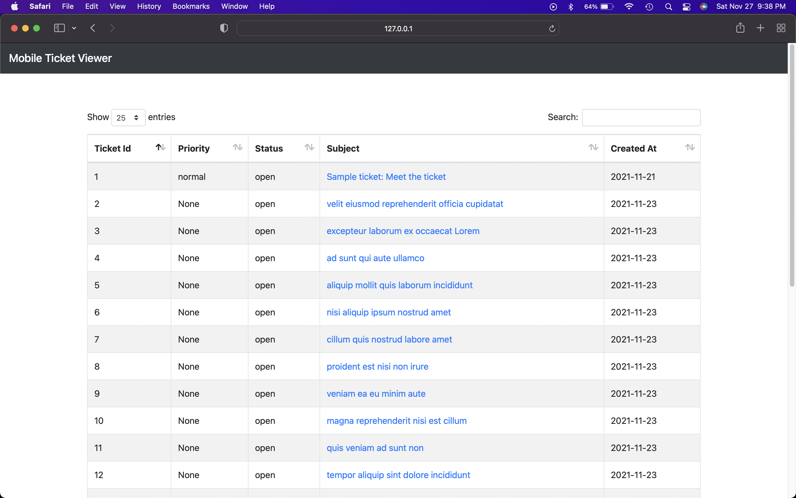
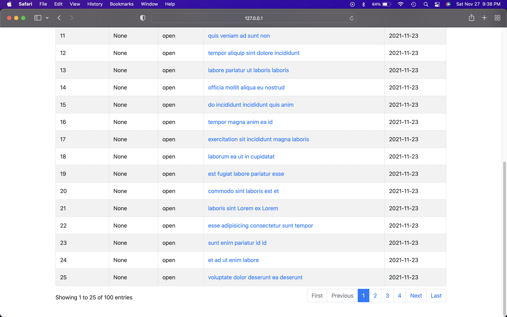
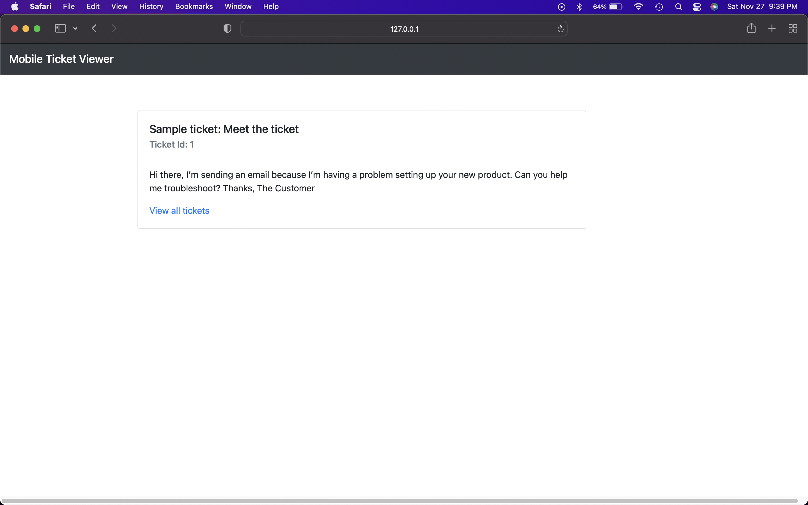
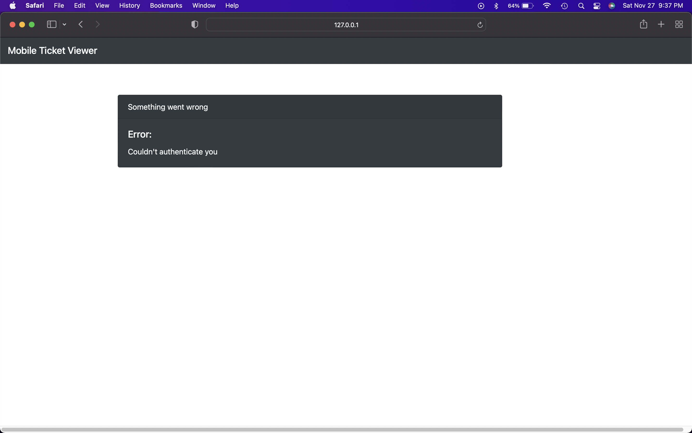
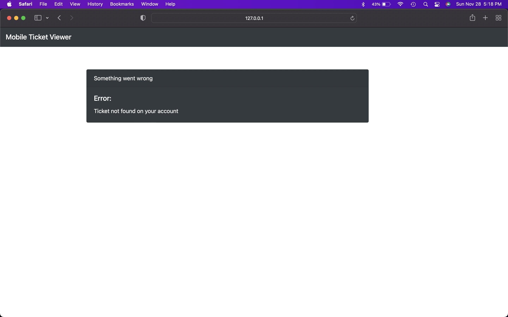
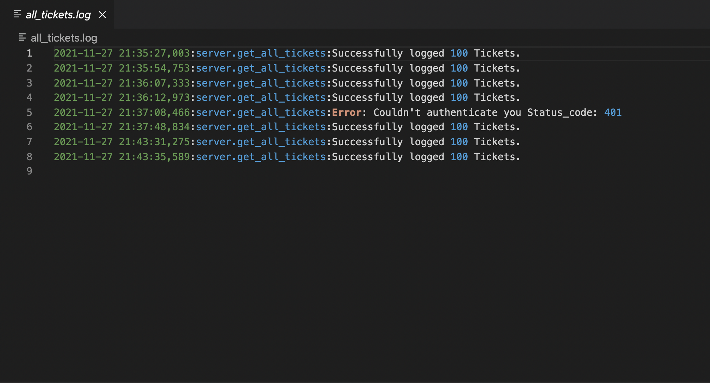
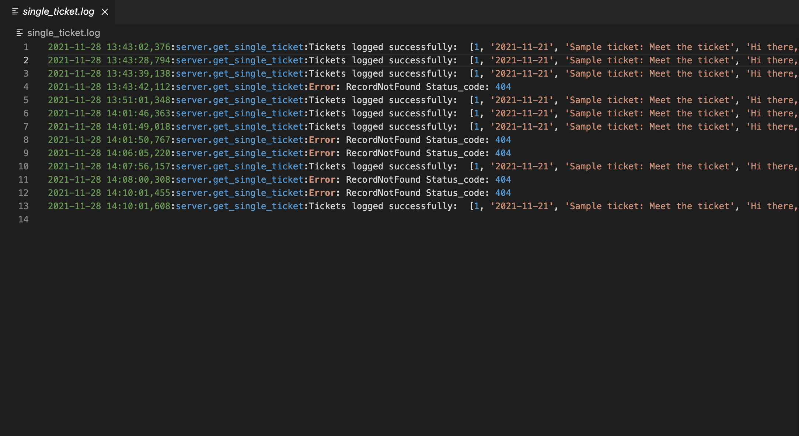

# Coding-Challenge - Aashay Motiwala

A web based application that is written using the Flask framework. The app makes an HTTP request to the Zendesk Ticket API, which returns a list of all tickets linked with the account. These tickets are then shown in a tabular style. Users can obtain information about all tickets or specific data about a particular ticket.

## Prerequisite Installations

- [Flask](https://pypi.org/project/Flask/)
- Python 3 or higher.

## Screen Shots
- Landing Page: (Displays 25 tickets per page)





- Single Ticket Info page: (Specific details about each ticket)



- Error Page: (If there is an authentication error with the API request) 



- Ticket not found error: (If the ticket id is not present on the user's accout)



## Live server

- When you run app.py
- Goto http://127.0.0.1:5000

## How to run (MacOS/Windows)

1. Download the repository to your local machine with the following code.

```
$ git clone https://github.com/Aashay12/Zendesk_coding_challenge.git
```

2. Navigate to the application folder using the terminal.

3. Make sure you have Flask and python3 installed.

4. Run the program with the following code.

```
$ pip3 install virtualenv
$ virtualenv venv
$ source venv/bin/activate
$ pip3 install -r requirements.txt
$ python3 app.py
```

### Unit Testing:

  - Test 1: Should preprocess the all the tickets into correct structure for rendering.
  - Test 2: Should preprocess a single ticket into correct structure for rendering.
  - Test 3: Test 'get_all_ticket' function. Check the API response and json data for all tickets.
  - Test 4: Test 'get_single_ticket' function. Check the API response and json data for all tickets.
  - Test 5: Check the whether the process_all_ticket function works as expected when passed empty Json
  - Test 6: Check the whether the process_single_ticket function works as expected when passed empty Json
  - Test 7: Check if ticket does not exist, then the get_single_ticket function shows the error

#### Run Tests

1. Navigate to the 'server' directory in your MacOS Terminal or equivalent command line application.

2. Run the tests with the following code
```
$ cd server/
$ python3  test_tickets.py
```

### Logging

- Used Python's Logger to handle diffferent logging levels.

- The All_tickets.log and Single_Ticket.log reports data about what the API returns and in case of any error it logs it in the file.






### Assumptions

- Users are familar with running a python program.
- Tickets requests and Error responses to the Zendesk API will always return JSON with the same structure.

### Component Description

- `app.py` : Program entry point, handles all the routes and passes data between different pages.
- `get_all_tickets.py` : Contains code for making http requests for receiving list of all tickets from the Zendesk Api.
- `get_single_ticket.py` : Contains code for making http requests for receiving data about a single ticket from the Zendesk Api.
- `home.html` : Web-page to display list of all tickets in a tabular format.
- `ticket.html` : Web-page to display data about a single ticket.
- `base.html` : Jinja template to hold the static html and js content.
- `all_tickets.log` : Log file that stores and reports any errors faced by the user while requesting list of tickets.
- `single_ticket.log` : Log file that stores and reports any errors faced by the user while requesting data about a ticket.
- `requirements.txt` : Text file for the required dependecies.

### Design Choices

- I used python along with Flask to design this web-app. Flask framework has no dependencies on external libraries. The framework offers extensions for open authentication systems and supports all latest technologies.

  #### Reasons why I used flask:

  - High scalability for simple applications,
  - Easy to build a quick prototype.
  - Routing URL is easy.
  - Supports Jinja2 which makes rendering UI easy.

#### Connecting and requesting tickets from the zendesk API

  - Authorization - Made API requests to Zendesk using the personal access token and OAuth Token provided by them. Username and password are not hardcoded in plain text, which would have left them vulnerable to being compomised.

### Frontend
   - Used HTML, CSS and JavaScript to desgin a simple frontend view. Used Datatable template to dislay all the tickets in a table along with pagination.

### Data templating
   - Used Jinja2 to retrieve the data from Flask framework and render it. 

  - Reasons why I used Jinja2:
    1. It is a fast, expressive, extensible templating engine.
    2. Easy to read, implement and eliminates a lot of redundant code.

### Display All Tickets
  - Pagingation - 
  Initially I considered to handle the pagination at the backend. But for this particular use case, I eventually decided to go with my current approach beacuse it had the following benefits:
    
    1. User do not need to make API calls everytime they jump to another page which might have resulted in increasing the traffic on the server side. Reducing the numebr of API calls and providing all the ticket at once helped me reduce the response time.
  
    2. Using the DataTable template for pagination made my code more readable.

  However, if the number of tickets on the server grew exponentially large, then I might have considered handling the pagination on the backend because it might have helped to reduce the bandwidth.

## Learning Resources

The following section contains links to resources I found super useful while building this application.

- Zendesk docs quick links

  - [Tickets](https://developer.zendesk.com/rest_api/docs/support/tickets#show-ticket)

  - [Basic Authentication](https://developer.zendesk.com/rest_api/docs/support/introduction#basic-authentication)

- Tips and best practices that helped me in writing code for error logging.

  - [Error Logging](https://www.loggly.com/use-cases/6-python-logging-best-practices-you-should-be-aware-of/)

- Reference for following practices to write Readme.md file.

  - [Github MD Files Formatting](https://help.github.com/en/articles/basic-writing-and-formatting-syntax)
